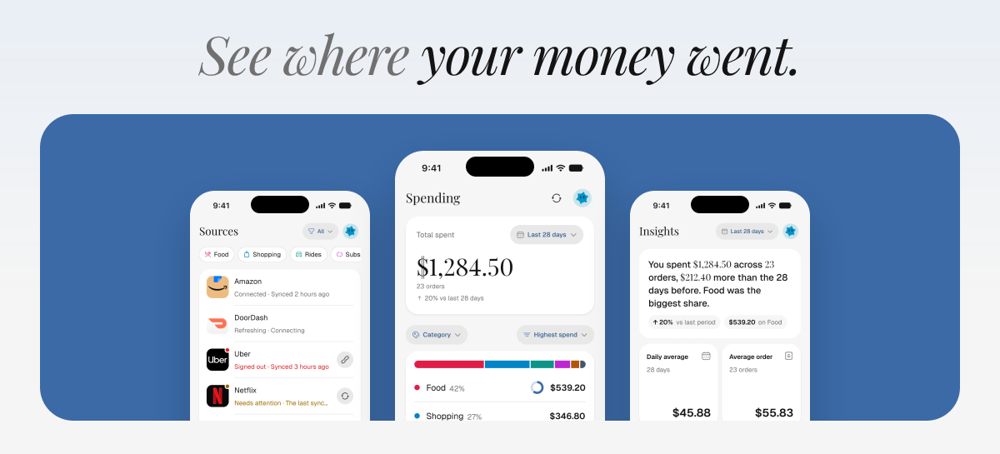

<div align="center">
  
  <h1>Depensa releases</h1>
  
</div>

Depensa is the expense tracker that reads your orders for you. Connect the shops you already buy from, and it reads your order history, so your spending adds up without typing in a single expense. No bank or card linking. Website: [depensa.techwithanirudh.com](https://depensa.techwithanirudh.com).

This repository holds Depensa's release builds and nothing else. The app's source code is not here.

## iPhone

Depensa isn't on the App Store. You install it yourself with SideStore or AltStore, which sign it with your own Apple Account. Each IPA here is **unsigned**: SideStore or AltStore re-signs it on your phone, and Depensa never sees your Apple Account.

**Install steps: [depensa.techwithanirudh.com/ios](https://depensa.techwithanirudh.com/ios)**

The source to add in SideStore or AltStore (Sources, then +):

```text
https://depensa.techwithanirudh.com/ios/source.json
```

That address serves [`source.json`](./source.json) from this repository. With Sideloadly, download the `.ipa` from the [latest release](https://github.com/techwithanirudh/depensa-releases/releases/latest) and install it from a Mac or Windows PC.

On a sideloaded iPhone, Depensa can't receive notifications and has no Sign in with Apple; sign in with your email or Google. It needs iOS 16.4 or later.

## Android

Depensa is on [Google Play](https://play.google.com/store/apps/details?id=com.techwithanirudh.depensa). You can also download the APK yourself, for a phone without Google Play or if you'd rather not use it.

To install the APK:

1. On your phone, open the [latest release](https://github.com/techwithanirudh/depensa-releases/releases/latest) and download the `.apk` file.
2. Open the downloaded file. If Android asks, allow your browser or file manager to install unknown apps, then go back and tap Install.

The APK is the same build as the one on Google Play, but Google Play re-signs its copy with its own key, so the two are signed differently and can't update each other. To switch from a Play install to the APK, or from the APK to Play, uninstall Depensa first. Your expenses are kept on your account, so you only need to sign in again.

Smaller fixes arrive inside the app on their own, as they do on Google Play. A new version doesn't install itself: download the APK from the latest release and open it; it installs over the old one and keeps you signed in. If your version gets too old to keep working, Depensa shows an Update required screen that points here. On a phone without Google Play services, Depensa may not receive notifications.

## Checking a download

Every version in `source.json` lists the IPA's size in bytes and its SHA-256. Each release's notes give the APK's SHA-256, and the release page shows it beside each file. On a Mac or Linux:

```sh
shasum -a 256 Depensa-*.ipa
shasum -a 256 Depensa-*.apk
```

On Windows, run `certutil -hashfile` with the file's name and `SHA256`. The result should match the one listed.

## Licence

The builds are covered by the Depensa project's licence, the GNU Affero General Public License v3.0 or later. Its text is in [LICENSE](./LICENSE).

Questions: depensa@techwithanirudh.com
